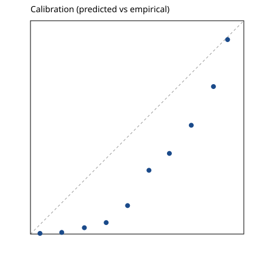
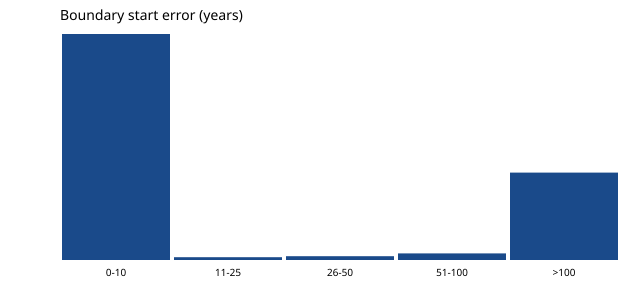
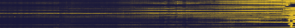

# Model Evaluation Report — nimble 9B (COW polities + PyPI packages)

> **Using this file as a template.** Copy this report, keep the section
> structure, and replace the bracketed fields: model identity, dates, dataset,
> command block, results tables, and findings. The *Evaluation criteria*
> section is model-independent — reuse it verbatim. Delete findings that don't
> apply and add what your maps show; every finding should cite a number or a
> figure from your own run.

## Summary

| field | value |
|---|---|
| model | `nimble:latest` — Bespoke-Nimble-9B, Q8_0 quant, 9.0B params |
| serving stack | Ollama 0.35.1, OpenAI-compatible endpoint, consumer GPU |
| evaluators | vibecodingagency, via Latent Atlas (commit `515eb41`) |
| date | 2026-10-04 |
| dataset | `curated_polities_cow.csv` (244 sovereign states, `exists`) + `curated_software_pypi.csv` (100 packages, `available`) |
| queries | 2,752 one-token Yes/No probes (eval mode), 24,647 (dissolved-states sweep) |
| headline | accuracy 0.729 / AUROC 0.873 / Brier 0.180; **dead polities never die** |

## Evaluation criteria

### What is being measured

Latent Atlas treats a model's factual knowledge as a field, not a lookup
table. For each entity it probes `P(claim | entity, year)` with one-token
Yes/No prompts and reads the logit difference between " Yes" and " No". This
report evaluates two claims:

1. **exists** — `P(state in existence | state, year)` over all 244 Correlates
   of War state-system members, 1816–present. Ground truth is membership
   entry/exit years (v2024); re-entries are separate labeled intervals.
2. **available** — `P(package usable on PyPI | package, year)` over the
   top-100 PyPI packages by downloads. Ground truth is each package's first
   upload to PyPI.

### Metrics

| metric | definition | how to read it |
|---|---|---|
| accuracy | fraction of correct Yes/No answers | baseline; hides *where* errors live |
| AUROC | probability a random positive outranks a random negative by `p_yes` | ranking quality, threshold-free |
| log loss / Brier | calibration of the full probability | a confidently wrong answer is punished more than a hedged one |
| boundary error (start/end) | where the model's P(Yes) crosses 0.5 vs the true interval edge, in years | the temporal analogue of coastline error; the single most revealing number for "does it know *when*" |
| interval IoU | overlap between the model's confident interval and truth | 1.0 = perfect interval; low IoU with high accuracy = edges misplaced |
| smoothness | mean year-to-year jump in P(Yes) per entity | noisy maps = unstable representation, not just uncertainty |

### Stratification

Queries are binned by where the sampled year sits relative to the true
interval: `interior`, `near_before`, `near_after`, `far_before`, `far_after`,
plus `era_confusable` (dates when a *different* famous entity of the same type
was active). Comparing bands separates broad knowledge (`far_*`) from
boundary precision (`near_*`) from entity discrimination (`era_confusable`).

### Known limitations of these criteria

- **COW start dates are conventions.** The system list begins at the
  Congress of Vienna (1816), so "did the USA exist in 1810" is labeled *no*
  even though the model's *yes* is defensible. `near_before` accuracy is
  therefore understated for early-entry states. Treat it as a
  benchmark-design lesson, not a model failure.
- **"Existed" is coarse.** It ignores governments-in-exile, occupations, and
  de facto vs de jure control (COW encodes sovereign control; WWII
  exits/re-entries reflect that).
- **PyPI first-upload ≠ project birth.** Django's first PyPI upload is 2010
  (project founded 2005); the fixture notes carry this caveat.
- **Thinking models need a prefill.** With `ATLAS_ASSISTANT_PREFILL="Answer:"`
  unset, nimble's first token is `Thinking` and Yes/No fall outside the
  top-logprobs window — scores collapse for a mechanical reason unrelated to
  knowledge. Always record this knob in the environment section.

## Environment & reproduction

```bash
# Ollama 0.35.1 serving nimble:latest (Q8_0) on a single consumer GPU
export ATLAS_BASE_URL="http://localhost:11434/v1"
export ATLAS_ASSISTANT_PREFILL="Answer:"   # required for thinking models

# data dir: copy fixtures/curated_polities_cow.csv + curated_software_pypi.csv into raw/
atlas normalize
atlas generate --mode eval
atlas probe --input generated/exists_yesno.ndjson --model nimble:latest
atlas probe --input generated/available_yesno.ndjson --model nimble:latest
atlas score --run runs/nimble:latest
atlas render --run runs/nimble:latest

# dissolved-states sweep (the zombie analysis below)
# raw/ contains only the 49 closed COW intervals
atlas generate --mode sweep
atlas probe --input generated/exists_yesno_sweep.ndjson --model nimble:latest
```

Probe: concurrency 16, one completion token per query, temperature unset
(logprobs read from a single deterministic call). 2,752 eval queries in ~7
min; 24,647 sweep queries in ~60 min. Everything is resumable.

## Results

### Overall and by relation

| slice | n | accuracy | AUROC | Brier |
|---|---|---|---|---|
| **overall** | 2,752 | 0.729 | 0.873 | 0.180 |
| exists (COW states) | 1,952 | 0.695 | 0.874 | 0.201 |
| available (PyPI) | 800 | 0.811 | 0.900 | 0.130 |

Field-shape metrics: boundary error start **256y** / end **13y**, mean
interval IoU **0.528**, smoothness **0.145**.

### By band (exists, n=1,952)

| band | n | accuracy | Brier | nimble yes-rate |
|---|---|---|---|---|
| interior | 1,327 | **0.983** | 0.041 | 0.98 |
| far_before | 244 | 0.834 | 0.115 | 0.20 |
| near_before | 439 | 0.197 | 1.259 | 0.87 |
| near_after | 49 | **0.184** | 1.388 | 0.82 |
| far_after | 49 | **0.265** | 0.530 | 0.73 |
| far_fallback | 244 | 0.773 | 0.134 | 0.29 |


Rows are states, columns are years; bright = P(exists) high. The modern map
is crisp; dissolved states (lower rows) stay bright to the right edge —
sharp left edges, no right edges.

### Comparison run: ternary-bonsai 1.7B (same queries)

| model | accuracy | AUROC | Brier | boundary start/end | IoU | smoothness |
|---|---|---|---|---|---|---|
| nimble (9B) | 0.729 | 0.873 | 0.180 | 256y / 13y | 0.528 | 0.145 |
| ternary-bonsai (1.7B) | 0.662 | 0.745 | 0.210 | 75y / 15y | 0.485 | 0.231 |




## Findings

### 1. Dead polities never die (primary finding)

40 of 49 dissolved states remain above P=0.5 long after their true end.
Median zombie lag **80 years**, mean 98, max 160:

| state | true end | last P≥0.5 | lag |
|---|---|---|---|
| Modena / Parma / Tuscany | 1860 | 2020 | +160y |
| Hanover | 1866 | 2020 | +154y |
| Bavaria | 1871 | 2020 | +149y |
| Austria | 1938 | 2020 | +82y |
| Poland | 1939 | 2020 | +81y |



The lag is not random: the model resurrects *nationally-remembered* states.
Poland and Austria "survive" their wartime interruptions because both exist
today — the interruption was never encoded. Bavaria, Saxony, and Tuscany
"live" on as Bundesländer and an Italian region. The model stores polities as
persistent cultural entities and never models their sovereign endpoints.

### 2. Endpoint blindness is polity-specific, not a generic Yes-bias

PyPI `available` scores 0.811 with clean phase transitions — packages don't
get "un-invented", and nimble knows it. The 98% interior / 82% near_after
split is specific to the polity representation.

### 3. The comparison model fails in the mirror image

ternary-bonsai leans "No" everywhere: only 63% yes *inside* intervals, near-
perfect "no" far from them. Its apparently *better* start-boundary error
(75y vs nimble's 256y) is an artifact of that bias — a model that says "no"
early has its 0.5-crossing close to the true start by accident. **Lesson for
template users: never read boundary error without the band yes-rates next to
it.** Nimble's worse start error partly reflects the same convention artifact
noted in *Limitations* (saying "yes" before 1816 is often right).

### 4. Smoothness separates representation noise from uncertainty

nimble's field is markedly smoother than ternary's (0.145 vs 0.231 mean
year-to-year jump): the 9B model holds a coherent global timeline while the
1.7B model's probability flickers — consistent with the scale/structure
story in the README's inspiration section.

## Caveats

- This is behavioral cartography: a systematic probe of *outputs*. It does
  not read activations, and a sharp coastline does not mean the model "stores
  a map".
- Eval set sizes for dissolved states are small (n=49) because most COW
  states still exist; the sweep finding (24,647 queries) is the stronger
  evidence and it agrees.
- One fixture, one prompt family, one serving stack. Cross-check headline
  numbers on a second template family before publishing strong claims.
- `near_before` on COW is contaminated by the 1816 convention (see
  *Limitations*); do not quote it as a model failure.

## Template checklist (for your own eval)

- [ ] Model identity: exact tag, quant, serving stack, version
- [ ] Dates and Latent Atlas commit
- [ ] Dataset: fixture names, row counts, relation(s), ground-truth source
- [ ] Environment: base URL, prefill knob, concurrency, query counts, runtime
- [ ] Reproduction commands (exact)
- [ ] Overall + by-relation + by-band tables, with yes-rates
- [ ] Field-shape metrics: boundary error (start/end), IoU, smoothness
- [ ] Figures: heatmap, calibration, boundary error
- [ ] At least one finding that cites a band breakdown, not just accuracy
- [ ] At least one caveat about the ground truth itself
- [ ] Comparison run against a second model, if available
